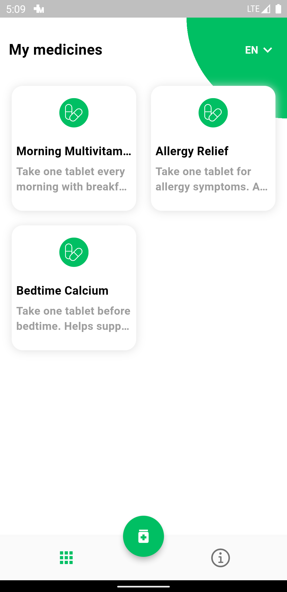

# Medisync - Medication Tracking App 🌡️💊

Medisync is a mobile application designed to help users efficiently manage their medication schedules, receive automatic reminders, and stay on top of their personal health. Whether you're juggling multiple medications or need assistance in adhering to a specific regimen, Medisync is here to simplify and streamline the process.

## Features 🚀

- **Medication Schedule:** Easily input and visualize your medication schedule.
- **Automatic Reminders:** Receive timely reminders to take your medications.
- **User-Friendly Interface:** Intuitive design for a seamless user experience.

## Screenshots 📱

  
   
  
  
  

## How to Use 🤔

1. Clone the repository: `git clone https://github.com/aibekdv/medisync.git`
2. Install dependencies: `flutter pub get`
3. Run the app: `flutter run`

Feel free to explore the code, provide feedback, and contribute to make MedTrack even better!

## Contributing 🤝

If you'd like to contribute, please fork the repository and create a pull request. Your contributions are more than welcome!

## Issues and Feedback 💬

If you encounter any issues or have suggestions for improvement, please [open an issue](https://github.com/aibekdv/medisync/issues). Your feedback is highly valued.

