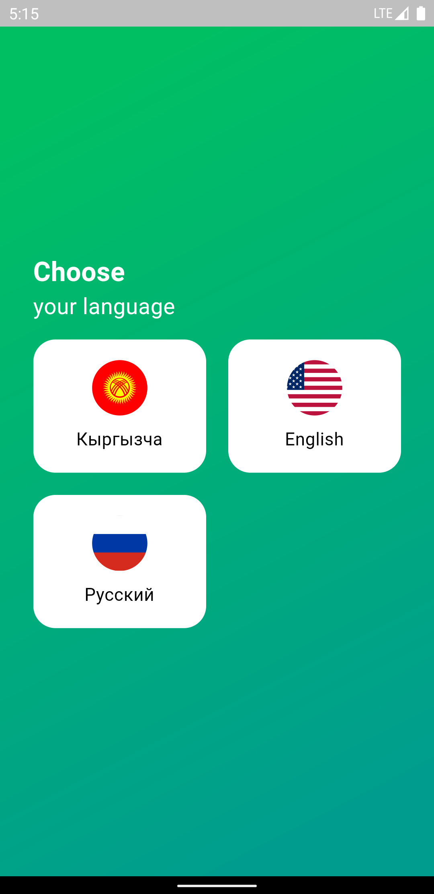

# Medisync - Medication Tracking App 🌡️💊

MediSync is your reliable companion for never missing a dose of your important medications. Our user-friendly app sends timely reminders to ensure you stay on top of your medication schedule. Set up customized reminders for each medication and receive notifications that help you remember when it's time to take your pills.

## Features 🚀

- **Medication Schedule:** Easily input and visualize your medication schedule.
- **Automatic Reminders:** Receive timely reminders to take your medications.
- **User-Friendly Interface:** Intuitive design for a seamless user experience.

## Screenshots 📱

  
   
  
  
  

## How to Use 🤔

1. Clone the repository: `git clone https://github.com/aibekdv/medisync.git`
2. Install dependencies: `flutter pub get`
3. Run the app: `flutter run`

Feel free to explore the code, provide feedback, and contribute to make MedTrack even better!

## Contributing 🤝

If you'd like to contribute, please fork the repository and create a pull request. Your contributions are more than welcome!

## Issues and Feedback 💬

If you encounter any issues or have suggestions for improvement, please [open an issue](https://github.com/aibekdv/medisync/issues). Your feedback is highly valued.

